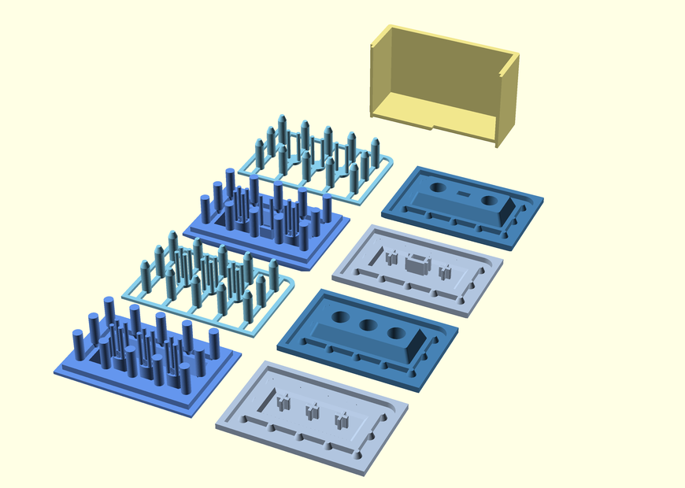
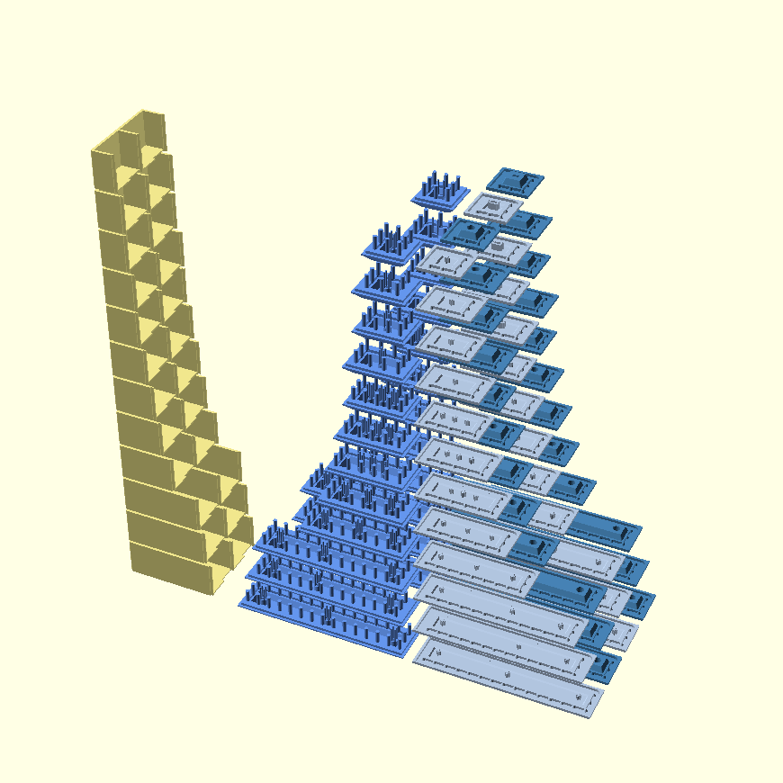

# Z-Butt OpenSCAD

An exploratory port of Zappycobra's [Z-Butt](https://github.com/imyownyear/Z-Butt) system to OpenSCAD.


## Models

STL models are available for download in the [releases](https://github.com/yatara-cc/z-butt-openscad/releases) section.


## Images







## Usage

`scad/z-butt.scad` is a library. It won't generate any geometry by itself. Instead it should be included in other OpenSCAD files where it's functions can be called.


### Example

```
include <z-butt.scad>

// An MX-stem master base, 2u in the X-axis:
mx_master_base(xu=2);
```


### Parameters

-   Measurements can be altered by changing values in the “User Parameters” section of the `z-butt.scad` library. Of particular note:
    -   `sprue_max_distance` can be used to make sprue placement denser or sparser
    -   `mx_offset` can be used to tune the fitment of the MX cross
-   MX stems for stabilizers have been included on larger spacebars, though these are tentative and it is advised to check them before printing. Stem placement can be edited in the functions `switches_xu` and `stabilizers_xu`.


### Maker's Mark

A Maker's Mark can be added by creating a 2-D polygon in `scad/makers-mark.scad`. See the file for an example.


### Building

For building on Linux, OpenSCAD and GNU Make should be installed.

From the root of the repository, run

```
make
```

Or to use, for example, four cores in parallel:

```
make -j 4
```


