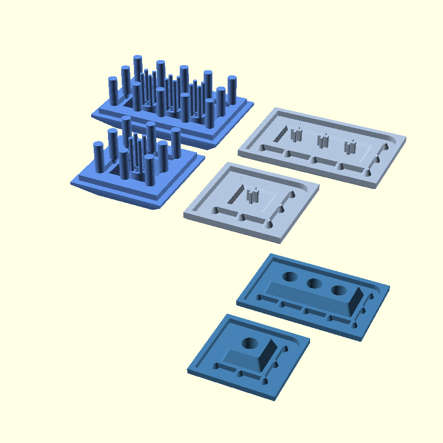

# Z-Butt OpenSCAD

An exploratory port of Zappycobra's [Z-Butt](https://github.com/imyownyear/Z-Butt) system to OpenSCAD.


## Notes

-   To reduce the repository size, only STLs for 1u and 2u keycaps have been included. The full set can be built from the repository by editing the `SIZES` variable in `Makefile` (see “Building” below).
-   Measurements can be altered by changing values in the “User Parameters” section of the `z-butt.scad` library.
-   Of particular note is the `sprue_max_distance` parameter, which can be used to make sprue placement denser or sparser.
-   MX stems for stabilizers have been included on larger spacebars, though these are tentative and it is advised to check them before printing.


## Images




## Maker's Mark

A Maker's Mark can be added by creating a 2-D polygon in `makers-mark.scad`. See the file for an example.


## Building

For building on Linux, OpenSCAD and GNU Make should be installed.

To rebuild the STLs after altering parameters, run:

```
make
```

Or to use, for example, four cores in parallel:

```
make -j 4
```


