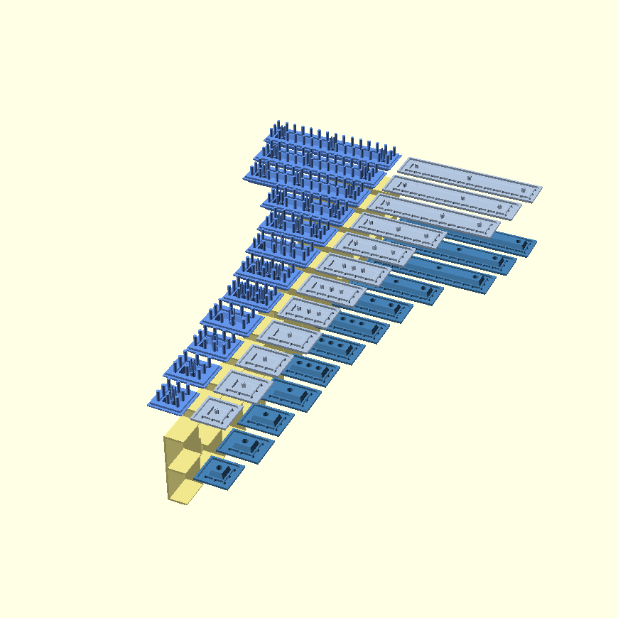

# Z-Butt OpenSCAD

An exploratory port of Zappycobra's [Z-Butt](https://github.com/imyownyear/Z-Butt) system to OpenSCAD.




## Building

Alter values in the “User Parameters” section of the `z-butt.scad` library.

To rebuild the STLs on Linux, with OpenSCAD and GNU Make installed, run:

```
make
```

Or to use, for example, four cores in parrallel:

```
make -j 4
```


