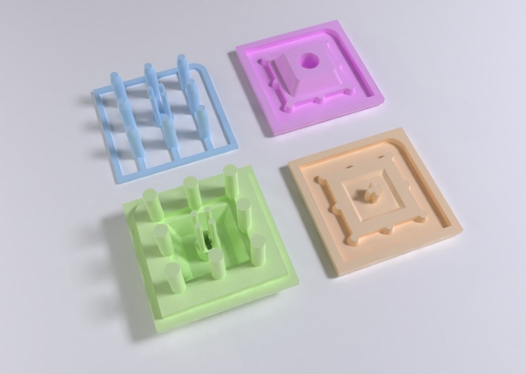
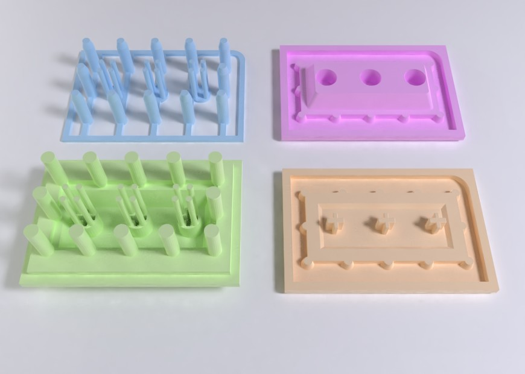
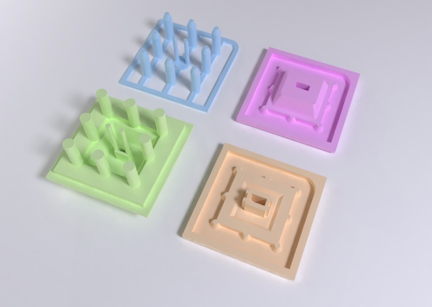
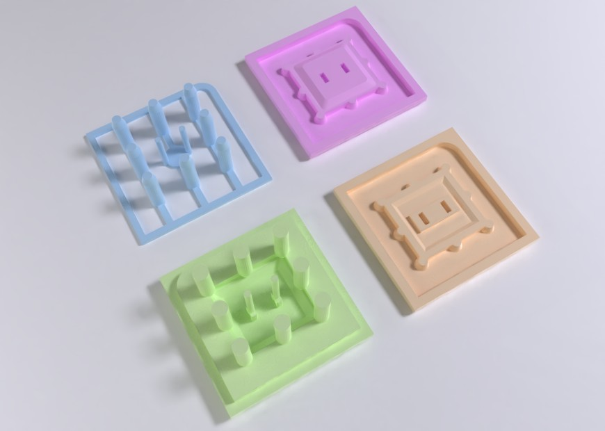
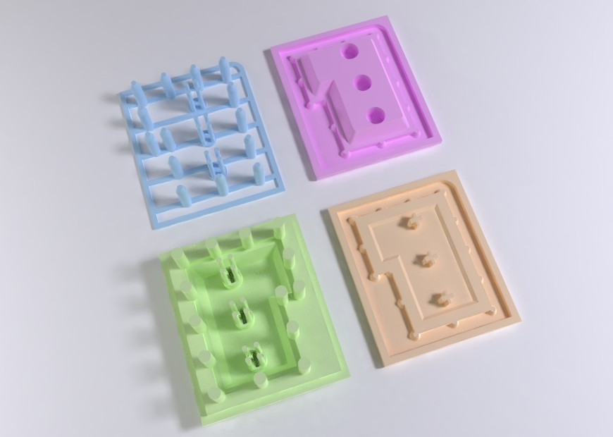
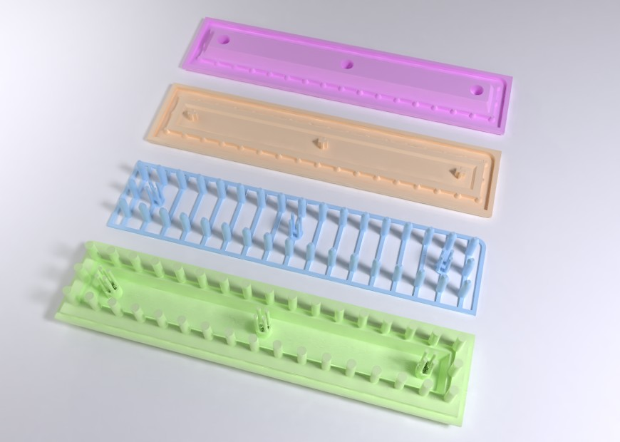
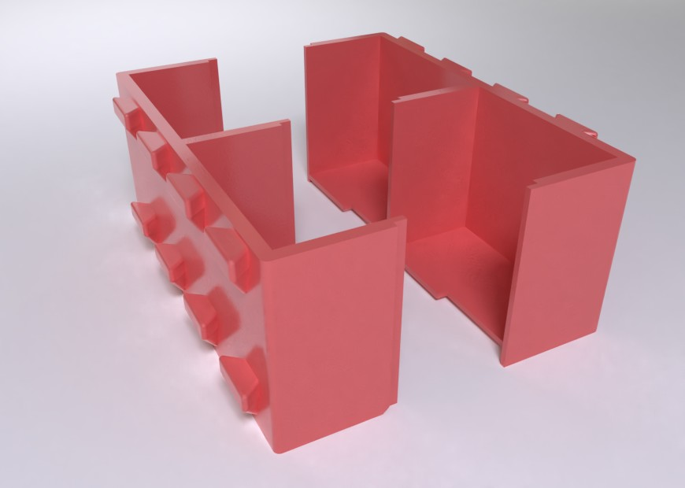

# Z-Butt OpenSCAD

A port of Zappycobra's [Z-Butt](https://github.com/imyownyear/Z-Butt) system to OpenSCAD.

STL models are available for download in the [releases](https://github.com/yatara-cc/z-butt-openscad/releases) section.


## Images
















## Compatibility

-   MX, Alps or Kailh Low-Profile stems for switches and stabilizers
-   Key sizes of 1u, 1.25u, 1.5u, 1.75u, 2u, 2.25u, 2.75u, 3u, 4u, 6u, 6.25u, and 7u
-   ISO enter and big-ass enter


## Usage

`scad/z-butt.scad` is a library. It won't generate any geometry by itself. Instead it should be included in other OpenSCAD files where it's functions can be called.


### Modules


-   `(mx/al/lp)_master_base` Base for casting a silicone mould of an existing keycap.
-   `(mx/al/lp)_sculpt_base` Base for sculpting a custom-shaped keycap
-   `(mx/al/lp)_stem_cavity` Stem cavity base (may need to be inverted for printing).
-   `(mx/al/lp)_sprues_only` Sprues with a frame for placing inverted on top of an existing blank key when casting a cavity mold.
-   `container` A container for casting silicone molds


#### Prefixes and Arguments

-   `mx` module prefix is for Cherry MX stems
-   `al` module prefix is for Alps stems
-   `lp` module prefix is for Kailh Low-Profile stems
-   `xu`: number of key units in X (1 unit is 19.05mm or 0.75 inches).
-   `yu`: Number of key units in Y
-   `name`: Name of specially-shaped key, eg. `iso-enter`, `big-ass-enter`
-   `yn`: Number of compartments in a container


### Examples


An Alps-stem master base, 2u in the X-axis:

```
include <z-butt.scad>

al_master_base(xu=2);
```


An MX-stem ISO enter cavity base:

```
include <z-butt.scad>

mx_stem_cavity(name="iso-enter");
```


### Parameters

-   Measurements can be altered by changing values in the “User Parameters” section of the `z-butt.scad` library. Of particular note:
    -   `sprue_max_distance`: make sprue placement denser or sparser
    -   `container_inset` tune the gap to the internal walls of the container
-   MX stems for stabilizers have been included on larger spacebars, though these are tentative and it is advised to check them before printing. Stem placement can be edited in the functions `switches_xu` and `stabilizers_xu`.


### Building

For building on Linux, OpenSCAD and GNU Make should be installed.

From the root of the repository, run

```
make
```

Or to use, for example, four cores in parallel:

```
make -j 4
```


